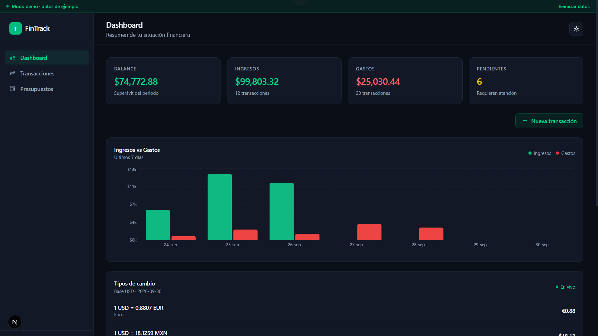
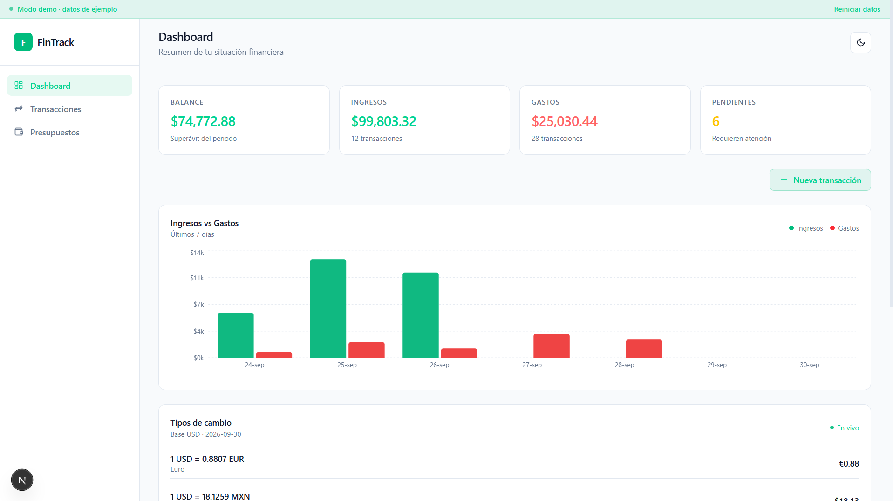
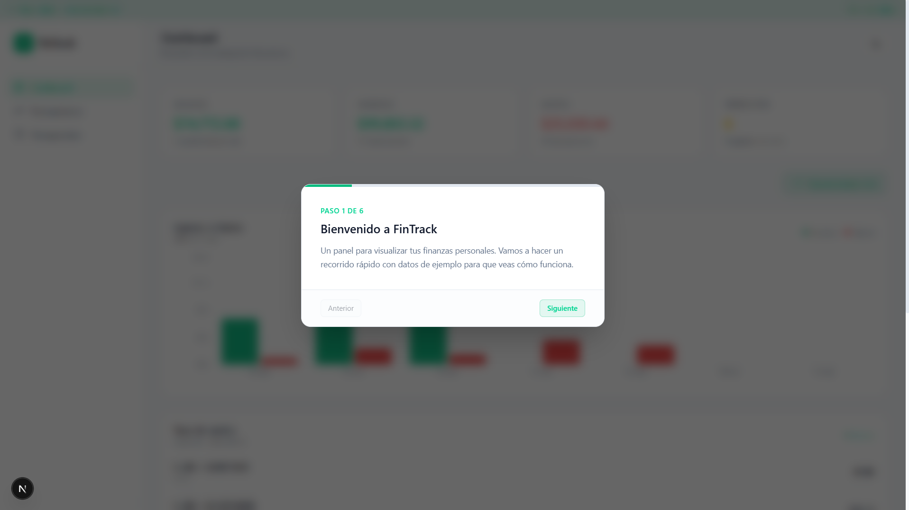
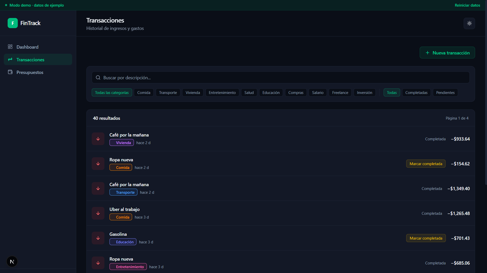
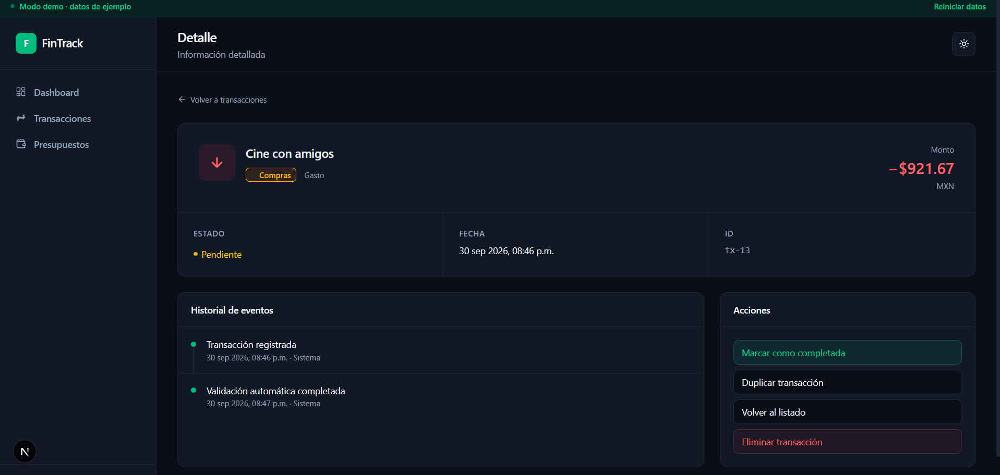
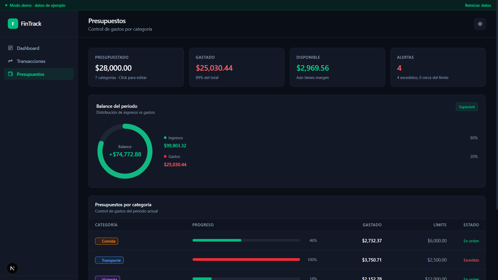

<div align="center">

<br>

# FinTrack

### Tus finanzas, claras en segundos.
### Your finances, clear in seconds.

<br>


<br>

<!-- Reemplaza con tu URL al deployar / Replace with your URL after deploying -->
**[🌐 Demo en vivo · Live demo](https://fintrack-tu-usuario.vercel.app)**

<br>

<br>



<br>
<br>

<table>
<tr>
<td width="50%">

### Dashboard


</td>
<td width="50%">

### Tutorial


</td>
</tr>
<tr>
<td width="50%">

### Transacciones


</td>
<td width="50%">

### Detalle


</td>
</tr>
</table>

<br>



<br>

**[🇬🇧 English](#-english)** &nbsp;·&nbsp; **[🇲🇽 Español](#-español)**

<br>

</div>

---

<br>

<a id="-english"></a>

# 🇬🇧 English

<div align="center">

A web dashboard to visualize income, expenses, budgets and exchange rates in real time.<br>
Designed for visual clarity and quick decisions: see your financial status in seconds.

</div>

<br>

## Highlights

<table>
<tr>
<td width="33%" valign="top">

### Clarity
KPIs, charts and recent activity in a single, clean view.

</td>
<td width="33%" valign="top">

### Real data
Live USD → MXN and EUR exchange rates from a public API.

</td>
<td width="33%" valign="top">

### Comfort
Dark-first design with an optional light theme.

</td>
</tr>
</table>

<br>

## Features

- **Dashboard** with KPIs (balance, income, expenses, pending), a 7-day chart and latest transactions
- **Transactions** with filters by category and status, real-time search and pagination
- **Transaction detail** with event history and actions
- **Budgets** by category with an editable total goal and automatic proportional redistribution
- **Real exchange rates** (USD → MXN, EUR) consumed live from the public [Frankfurter](https://frankfurter.app) API
- **Demo mode** with a 6-step welcome tutorial; keep the sample data or start from scratch
- **Empty state** with the option to load sample data when starting clean
- **Manual transaction entry** through a creation modal
- **Dark mode** persisted in localStorage

<br>

## Tech stack

| Technology | Purpose |
|:--|:--|
| **Next.js 16** (App Router) | Base framework, routing and API Routes |
| **TypeScript** | Strict typing across the project |
| **React 18** | Components and interaction |
| **Tailwind CSS 4** | Styling with design tokens via CSS variables |
| **Zustand** | Global state (transactions, budgets, filters) |
| **Recharts** | Income vs. expenses chart |
| **react-hot-toast** | Notifications |
| **Frankfurter API** | Real exchange rates |

<br>

## Design decisions

- **Dark-first with an optional light theme.** Financial dashboards are used during long work sessions; a well-calibrated dark theme reduces eye strain.
- **Real data when possible, mock data when not.** Exchange rates come live from Frankfurter (cached for 1 hour through a Next API Route). Transactions are sample data because they would require a real banking integration, out of scope for a demo.
- **Empty state + welcome tutorial.** A portfolio project should never look empty, but it shouldn't force data either: the user decides whether to explore with the demo or start from scratch.
- **Editable budgets with proportional redistribution.** When the total goal changes, category limits are readjusted while keeping their original proportions, like real financial apps do.
- **External API proxy.** The client never calls Frankfurter directly; it always goes through `/api/rates` to avoid CORS, cache responses and keep the external URL hidden.

<br>

## Project structure

```
fintrack/
│
├── 📁 app/
│   ├── api/rates/route.ts        Proxy to Frankfurter
│   ├── transactions/
│   │   ├── page.tsx              List + filters + pagination
│   │   └── [id]/page.tsx         Detail
│   ├── budgets/page.tsx          Budgets
│   ├── layout.tsx
│   └── page.tsx                  Dashboard
│
├── 📁 components/
│   ├── Layout/                   Sidebar, Header, ThemeToggle
│   ├── BalanceGauge.tsx
│   ├── BudgetTable.tsx
│   ├── CategoryBadge.tsx
│   ├── EditBudgetsModal.tsx
│   ├── EmptyState.tsx
│   ├── ExchangeRates.tsx
│   ├── KPICard.tsx
│   ├── NewTransactionModal.tsx
│   ├── Skeleton.tsx
│   ├── TransactionCard.tsx
│   ├── TransactionFilters.tsx
│   ├── TransactionsChart.tsx
│   └── Tutorial.tsx
│
└── 📁 lib/
    ├── api.ts                    Mock + Frankfurter client
    ├── store.ts                  Zustand store
    ├── types.ts                  Types
    └── utils.ts                  Helpers + category config
```

<br>

## Getting started

```bash
# Clone
git clone https://github.com/G1L08/fintrack.git
cd fintrack

# Install
npm install

# Development
npm run dev
# → http://localhost:3000

# Production build
npm run build
npm start
```

<br>

## Roadmap

- [ ] Data persistence with Zustand persist (localStorage)
- [ ] CSV/PDF export
- [ ] User-customizable categories
- [ ] Multi-currency with automatic conversion
- [ ] Fully responsive mobile mode

<br>

---

<br>

<a id="-español"></a>

# 🇲🇽 Español

<div align="center">

Dashboard web para visualizar ingresos, gastos, presupuestos y tipos de cambio en tiempo real.<br>
Diseñado con un enfoque en claridad visual y decisiones rápidas: ve tu estado financiero en segundos.

</div>

<br>

## Lo esencial

<table>
<tr>
<td width="33%" valign="top">

### Claridad
KPIs, gráficos y actividad reciente en una sola vista limpia.

</td>
<td width="33%" valign="top">

### Datos reales
Tipos de cambio USD → MXN y EUR en vivo desde una API pública.

</td>
<td width="33%" valign="top">

### Comodidad
Diseño dark-first con tema claro opcional.

</td>
</tr>
</table>

<br>

## Características

- **Dashboard** con KPIs (balance, ingresos, gastos, pendientes), gráfico de los últimos 7 días y últimas transacciones
- **Transacciones** con filtros por categoría y estado, búsqueda en tiempo real y paginación
- **Detalle de transacción** con historial de eventos y acciones
- **Presupuestos** por categoría con meta total editable y redistribución proporcional automática
- **Tipos de cambio reales** (USD → MXN, EUR) consumidos en vivo desde la API pública de [Frankfurter](https://frankfurter.app)
- **Modo demo** con tutorial de bienvenida de 6 pasos; conserva los datos de ejemplo o empieza desde cero
- **Estado vacío** con opción de cargar datos de ejemplo cuando se empieza limpio
- **Alta manual de transacciones** con modal de creación
- **Dark mode** con persistencia en localStorage

<br>

## Tecnologías

| Tecnología | Uso |
|:--|:--|
| **Next.js 16** (App Router) | Framework base, routing y API Routes |
| **TypeScript** | Tipado estricto en todo el proyecto |
| **React 18** | Componentes e interacción |
| **Tailwind CSS 4** | Estilos con design tokens vía variables CSS |
| **Zustand** | Estado global (transacciones, presupuestos, filtros) |
| **Recharts** | Gráfico de ingresos vs gastos |
| **react-hot-toast** | Notificaciones |
| **Frankfurter API** | Tipos de cambio reales |

<br>

## Decisiones de diseño

- **Dark-first con tema claro opcional.** Los dashboards financieros se usan en sesiones de trabajo prolongadas; un tema oscuro bien calibrado reduce la fatiga visual.
- **Datos reales cuando es posible, mock cuando no.** Los tipos de cambio vienen de Frankfurter en vivo (con caché de 1 hora vía API Route de Next). Las transacciones son datos de ejemplo porque requerirían una integración bancaria real, fuera del alcance de un demo.
- **Estado vacío + tutorial de bienvenida.** Un portafolio nunca debe verse vacío, pero tampoco debe forzar datos: el usuario decide si explorar con el demo o empezar desde cero.
- **Presupuestos editables con redistribución proporcional.** Al cambiar la meta total, los límites por categoría se reajustan manteniendo su proporción original, como lo hacen las apps financieras reales.
- **Proxy de la API externa.** El cliente nunca llama a Frankfurter directamente; siempre pasa por `/api/rates` para evitar CORS, cachear respuestas y no exponer la URL externa.

<br>

## Estructura del proyecto

```
fintrack/
│
├── 📁 app/
│   ├── api/rates/route.ts        Proxy a Frankfurter
│   ├── transactions/
│   │   ├── page.tsx              Lista + filtros + paginación
│   │   └── [id]/page.tsx         Detalle
│   ├── budgets/page.tsx          Presupuestos
│   ├── layout.tsx
│   └── page.tsx                  Dashboard
│
├── 📁 components/
│   ├── Layout/                   Sidebar, Header, ThemeToggle
│   ├── BalanceGauge.tsx
│   ├── BudgetTable.tsx
│   ├── CategoryBadge.tsx
│   ├── EditBudgetsModal.tsx
│   ├── EmptyState.tsx
│   ├── ExchangeRates.tsx
│   ├── KPICard.tsx
│   ├── NewTransactionModal.tsx
│   ├── Skeleton.tsx
│   ├── TransactionCard.tsx
│   ├── TransactionFilters.tsx
│   ├── TransactionsChart.tsx
│   └── Tutorial.tsx
│
└── 📁 lib/
    ├── api.ts                    Mock + cliente de Frankfurter
    ├── store.ts                  Zustand
    ├── types.ts                  Tipos
    └── utils.ts                  Helpers + configuración de categorías
```

<br>

## Correr localmente

```bash
# Clonar
git clone https://github.com/G1L08/fintrack.git
cd fintrack

# Instalar
npm install

# Desarrollo
npm run dev
# → http://localhost:3000

# Build de producción
npm run build
npm start
```

<br>

## Hoja de ruta

- [ ] Persistencia de datos con Zustand persist (localStorage)
- [ ] Exportación a CSV/PDF
- [ ] Categorías personalizables por el usuario
- [ ] Multi-moneda con conversión automática
- [ ] Modo responsive completo para móvil

<br>

---

<br>

<div align="center">

## Contact · Contacto

### Hecho por | Made by **José Gil Ramírez Onofre**

<br>

[](mailto:ramirezonofrejosegil@gmail.com)
[](https://www.linkedin.com/in/jose-gil-ramirez-onofre-461b41342/)
[](https://github.com/G1L08)

<br>

<sub>ramirezonofrejosegil@gmail.com</sub>


</div>
